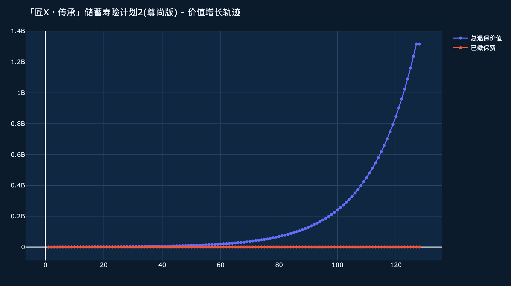
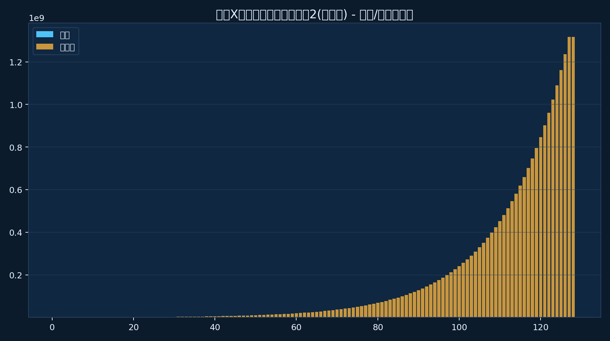
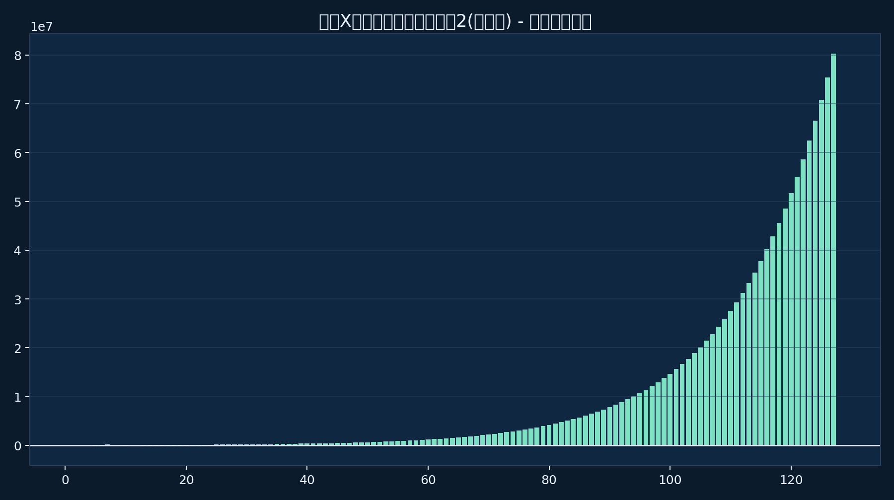
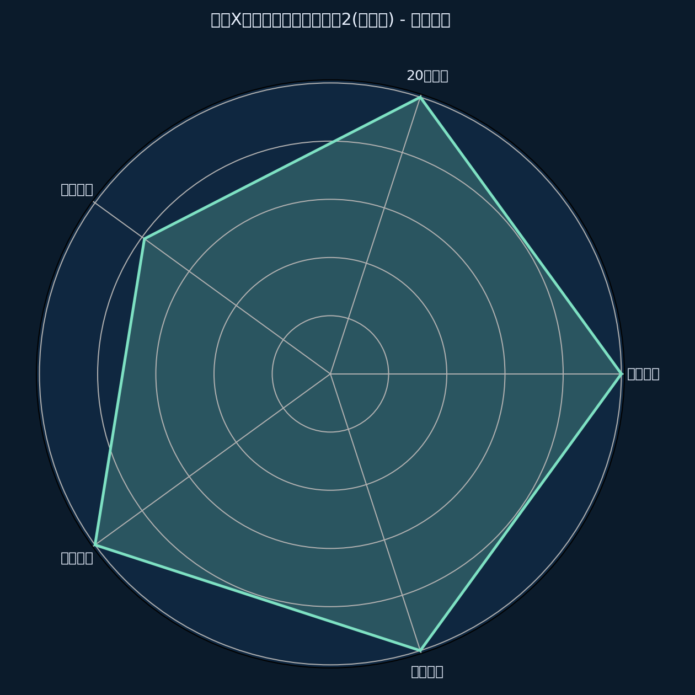

<!-- _class: cover -->
# Boxie 家庭
## 家庭资产配置定制方案

---

## Boxie 家庭

  

  
<ul><li>产品方案: 「匠X・传承」储蓄寿险计划2(尊尚版)</li><li>关键数字:</li><li>回本: 第7年</li><li>20年: 2.7x</li><li>生成日期: 29/5/2026</li></ul>
图表解读：先看趋势，再看关键年份，再讲可执行结论。

---

## 合作机构

  

  
<ul><li>周大福人寿提供保障、储蓄与传承规划服务，定位长期家庭财富与保障管理。</li><li>&gt; **视觉风格**: 简洁白色背景，左侧公司Logo占位区，右侧公司介绍文字</li><li>&gt; **叙事文案**: 选择专业可靠的合作伙伴，为您的财务规划保驾护航</li><li>&gt; **图表类型**: 纯文本</li></ul>
本页用于销售沟通，强调场景与关键数字，而非全文复述。

---

## 第 undefined 页: undefined

  

  
<ul><li>undefined</li><li>&gt; **视觉风格**: 标准布局</li><li>&gt; **图表类型**: undefined</li></ul>
图表解读：先看趋势，再看关键年份，再讲可执行结论。

---

## 第 undefined 页: undefined

  

  
<ul><li>undefined</li><li>&gt; **视觉风格**: 标准布局</li><li>&gt; **图表类型**: undefined</li></ul>
图表解读：先看趋势，再看关键年份，再讲可执行结论。

---

## 「匠X・传承」储蓄寿险计划2(尊尚版) (储蓄险)

  

  
<ul><li>受保人: VIP 先生 | 1岁 | 男</li><li>产品特点:</li><li>5年缴款，灵活规划</li><li>复归红利+终期分红，双重增值</li><li>独特优势:</li></ul>
图表解读：先看趋势，再看关键年份，再讲可执行结论。

---

## 封面

  

  
<ul><li>内容重点: 客户姓名 + 产品名称 + 核心卖点数字</li><li>强调要点:</li><li>回本年份: 第7年</li><li>叙事文案:</li><li>这份 「匠X・传承」储蓄寿险计划2(尊尚版) 让您的 $100K 年缴转化为 $514K 的账户价值</li></ul>
本页用于销售沟通，强调场景与关键数字，而非全文复述。

---

## 关键数字

  

  
<ul><li>回本 (第7年)</li><li>价值: $514K</li><li>已缴保费 $500K，账户价值 $514K，成功回本</li><li>1.3x (第10年)</li><li>价值: $638K</li></ul>
图表解读：先看趋势，再看关键年份，再讲可执行结论。

---

## 综合方案建议

  

  
<ul><li>方案定位</li><li>5年缴，每年 $100K，总投入 $500K。第7年回本，第17年翻2.0倍</li><li>下一步行动</li><li>详细了解各产品具体条款</li><li>根据个人需求调整保障额度</li></ul>
图表解读：先看趋势，再看关键年份，再讲可执行结论。

---

## 感谢

  

  
<ul><li>感谢您的时间</li><li>期待为您提供专业服务</li><li>本文件仅供参考，不构成要约或建议。</li><li>非保证金额并非保证，实际可能高于或低于预期。</li><li>&gt; **视觉风格**: 深色背景，大字“感谢”，副标题居中，底部免责小字</li></ul>
本页用于销售沟通，强调场景与关键数字，而非全文复述。

---

## 附加说明

  

  
<ul><li>匠心傳承儲蓄計劃2尊尚版.pdf: 「匠X・传承」储蓄寿险计划2(尊尚版) (储蓄险)</li><li>**「匠X・传承」储蓄寿险计划2(尊尚版)**:</li><li>回本 (第7年): $514K</li><li>1.3x (第10年): $638K</li><li>2.7x (第20年): $1366K</li></ul>
本页用于销售沟通，强调场景与关键数字，而非全文复述。

