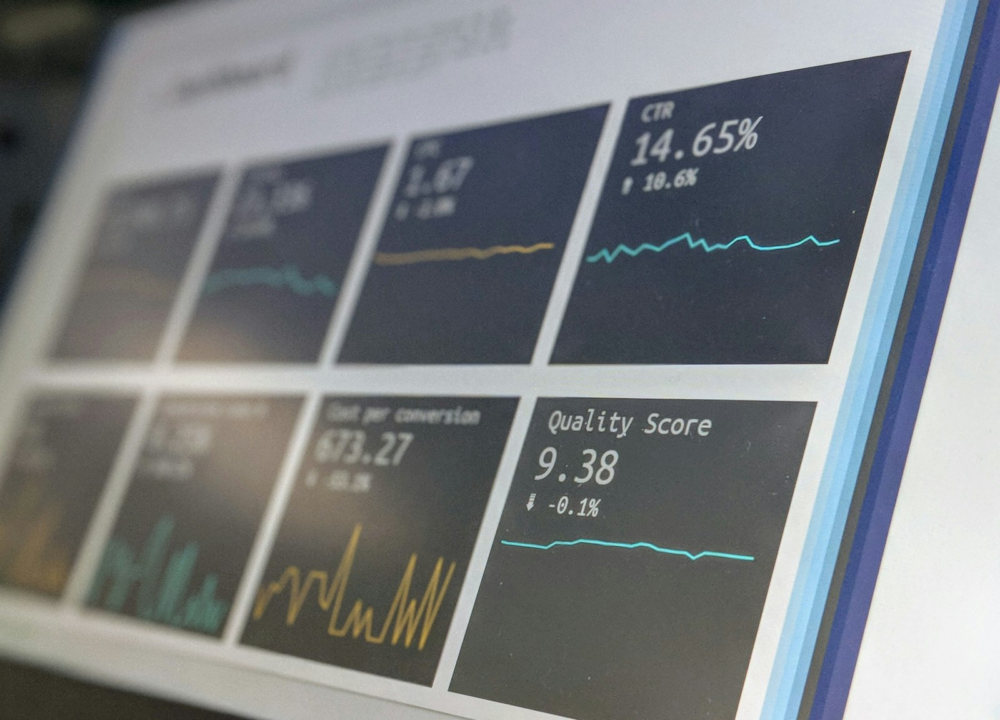

<!-- _class: cover -->
# VIP 先生
## 家庭资产配置定制方案

---

## VIP 先生 家庭资产配置方案

  

  
<ul><li>环X盈活储蓄保险计划(5年缴费)</li></ul>

---

## 公司介绍与资质

  

  
<ul><li>友邦保险</li><li>资料来源：CTFLife_Market Insight_2024年周大福人壽分紅實現率表現全攻略_2507_(TradChi).pdf</li><li>资料来源：周大福人壽醫療增值服務_TC.pdf</li></ul>

---

## 教育金方案（按年龄自动分流）

  

  
<ul><li>目标：18-21岁教育金</li><li>输出：起提年份、累计提领、剩余现金价值</li></ul>
开始提领：保单第6年（约7岁）；18岁累计提领：US$0；21岁累计提领：US$525,006

---

## 价值增长曲线（默认展示到保单80年）

  

  
<ul><li>不提领20/30年相对本金倍数</li><li>长期增长趋势</li></ul>
不提领20年：约本金2.72倍；不提领30年：约本金5.85倍。

---

## 保证/非保证构成（默认展示到保单80年）

  

  
<ul><li>保证底盘与弹性贡献</li></ul>
先看保证底盘，再看非保证弹性，明确长期收益主要来源。

---

## 里程碑一：前中期资金规划

<h3>10岁</h3>
保单第9年

年提领 US$35,000

累计提领 US$140,001

剩余价值 US$424,733

<h3>20岁</h3>
保单第19年

年提领 US$35,001

累计提领 US$490,006

剩余价值 US$531,764

<h3>30岁</h3>
保单第29年

年提领 US$35,003

累计提领 US$840,015

剩余价值 US$699,318

<h3>45岁</h3>
保单第44年

年提领 US$35,003

累计提领 US$1,365,051

剩余价值 US$1,154,504

---

## 里程碑二：中后期与养老规划

<h3>45岁</h3>
保单第44年

年提领 US$35,003

累计提领 US$1,365,051

剩余价值 US$1,154,504

<h3>60岁</h3>
保单第59年

年提领 US$35,020

累计提领 US$1,890,177

剩余价值 US$2,463,361

<h3>65岁</h3>
保单第64年

年提领 US$35,000

累计提领 US$2,065,252

剩余价值 US$3,315,208

<h3>80岁</h3>
保单第79年

年提领 US$35,057

累计提领 US$2,590,891

剩余价值 US$7,710,345

---

## 提领方案数据表（每10年）

<table class="data-table"><thead><tr><th>年龄</th><th>保单年度</th><th>已交总保费</th><th>领取金额</th><th>累计领取</th><th>退保现金价值</th><th>单利</th><th>复利</th></tr></thead><tbody><tr><td>2</td><td>1</td><td>100,000</td><td>0</td><td>0</td><td>2,643</td><td>-97.36%</td><td>-97.36%</td></tr><tr><td>11</td><td>10</td><td>500,000</td><td>35,000</td><td>175,001</td><td>449,186</td><td>-1.02%</td><td>-1.07%</td></tr><tr><td>21</td><td>20</td><td>500,000</td><td>35,000</td><td>525,006</td><td>553,772</td><td>0.54%</td><td>0.51%</td></tr><tr><td>31</td><td>30</td><td>500,000</td><td>35,003</td><td>875,018</td><td>716,823</td><td>1.45%</td><td>1.21%</td></tr><tr><td>41</td><td>40</td><td>96,686</td><td>35,005</td><td>1,225,045</td><td>985,224</td><td>22.97%</td><td>5.98%</td></tr><tr><td>51</td><td>50</td><td>73,563</td><td>35,007</td><td>1,575,098</td><td>1,526,323</td><td>39.50%</td><td>6.25%</td></tr><tr><td>61</td><td>60</td><td>62,128</td><td>35,008</td><td>1,925,185</td><td>2,610,075</td><td>68.35%</td><td>6.43%</td></tr><tr><td>71</td><td>70</td><td>500,000</td><td>35,013</td><td>2,275,414</td><td>4,607,809</td><td>11.74%</td><td>3.22%</td></tr><tr><td>81</td><td>80</td><td>500,000</td><td>35,008</td><td>2,625,899</td><td>8,176,510</td><td>19.19%</td><td>3.55%</td></tr><tr><td>91</td><td>90</td><td>500,000</td><td>35,061</td><td>2,976,915</td><td>14,874,836</td><td>31.94%</td><td>3.84%</td></tr><tr><td>101</td><td>100</td><td>500,000</td><td>35,497</td><td>3,329,531</td><td>27,446,484</td><td>53.89%</td><td>4.09%</td></tr><tr><td>111</td><td>110</td><td>51,479</td><td>35,389</td><td>3,683,718</td><td>51,042,767</td><td>900.48%</td><td>6.47%</td></tr><tr><td>121</td><td>120</td><td>51,333</td><td>36,341</td><td>4,040,361</td><td>95,333,722</td><td>1546.80%</td><td>6.47%</td></tr><tr><td>122</td><td>121</td><td>51,323</td><td>36,328</td><td>4,076,689</td><td>101,494,085</td><td>1633.52%</td><td>6.47%</td></tr><tr><td>123</td><td>122</td><td>51,313</td><td>36,133</td><td>4,112,822</td><td>108,055,068</td><td>1725.25%</td><td>6.47%</td></tr></tbody></table>

缴费方式：10万美金 × 5年约第40年达到2倍约第40年达到3倍单利/复利用于观察阶段性效率

---

## 不提领方案数据表（每10年）

<table class="data-table"><thead><tr><th>年龄</th><th>保单年度</th><th>已交总保费</th><th>领取金额</th><th>累计领取</th><th>退保现金价值</th><th>单利</th><th>复利</th></tr></thead><tbody><tr><td>2</td><td>1</td><td>100,000</td><td>0</td><td>0</td><td>103</td><td>-99.90%</td><td>-99.90%</td></tr><tr><td>11</td><td>10</td><td>500,000</td><td>0</td><td>0</td><td>659,765</td><td>3.20%</td><td>2.81%</td></tr><tr><td>21</td><td>20</td><td>500,000</td><td>0</td><td>0</td><td>1,357,738</td><td>8.58%</td><td>5.12%</td></tr><tr><td>31</td><td>30</td><td>500,000</td><td>0</td><td>0</td><td>2,927,387</td><td>16.18%</td><td>6.07%</td></tr><tr><td>71</td><td>70</td><td>500,000</td><td>0</td><td>0</td><td>34,128,321</td><td>96.08%</td><td>6.22%</td></tr><tr><td>81</td><td>80</td><td>500,000</td><td>0</td><td>0</td><td>64,063,551</td><td>158.91%</td><td>6.25%</td></tr><tr><td>91</td><td>90</td><td>500,000</td><td>0</td><td>0</td><td>120,256,092</td><td>266.12%</td><td>6.28%</td></tr><tr><td>101</td><td>100</td><td>500,000</td><td>0</td><td>0</td><td>225,737,215</td><td>450.47%</td><td>6.30%</td></tr></tbody></table>

缴费方式：10万美金 × 5年约第20年达到2倍约第30年达到3倍单利/复利用于观察阶段性效率

---

## 结束语与祝愿

  

  
<ul><li>祝愿家庭资产稳健增长、代际传承顺利</li></ul>

