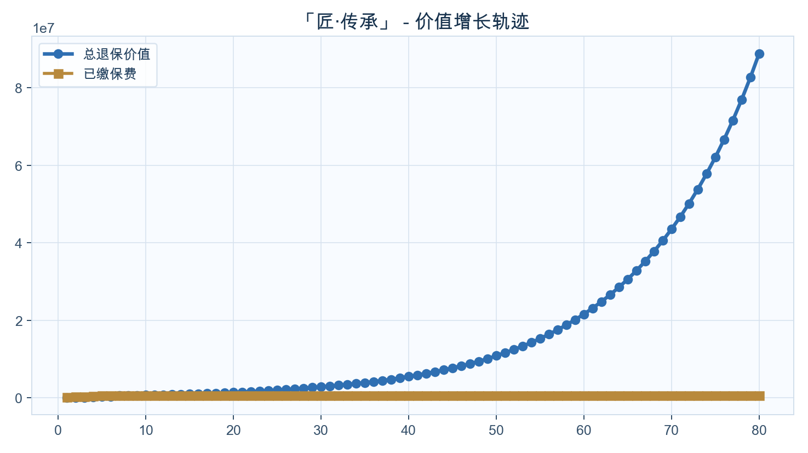
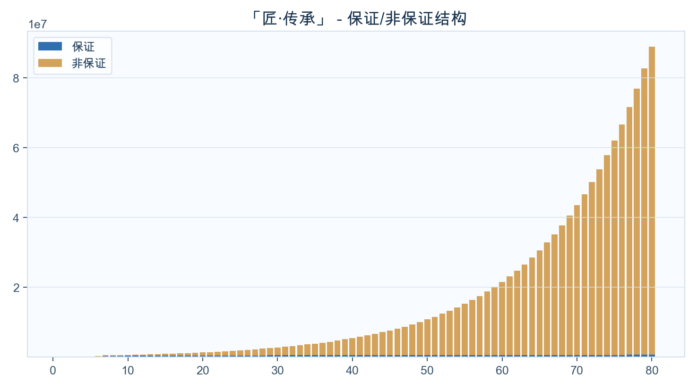

<!-- _class: cover -->
# VIP 先生
## 家庭资产配置定制方案
### 「匠·传承」

---

## 公司介绍与资质

  

  
<ul><li>周大福人寿</li><li>周大福人寿提供保障、储蓄与传承规划服务，定位长期家庭财富与保障管理。</li><li>Fitch 财务实力评级: A-</li><li>Moody's 财务实力评级: A3</li><li>香港RBC偿付能力充足率: 282%</li></ul>

---

## 教育金方案（按年龄自动分流）

  

  
<ul><li>目标：18-21岁教育金</li><li>输出：起提年份、累计提领、剩余现金价值</li></ul>
开始提领：保单第6年（约7岁）；18岁累计提领：US$420,005；21岁累计提领：US$525,006

---

## 价值增长曲线（默认展示到保单80年）

  

  
<ul><li>不提领20/30年相对本金倍数</li><li>长期增长趋势</li></ul>
不提领20年：约本金2.73倍；不提领30年：约本金5.57倍。

---

## 保证/非保证构成（默认展示到保单80年）

  

  
<ul><li>保证底盘与弹性贡献</li></ul>
先看保证底盘，再看非保证弹性，明确长期收益主要来源。

---

## 里程碑一：前中期资金规划

<h3>10岁</h3>
保单第9年

年提领 US$35,000

累计提领 US$140,001

剩余价值 US$424,733

<h3>20岁</h3>
保单第19年

年提领 US$35,001

累计提领 US$490,006

剩余价值 US$579,763

<h3>30岁</h3>
保单第29年

年提领 US$35,003

累计提领 US$840,014

剩余价值 US$843,476

<h3>45岁</h3>
保单第44年

年提领 US$35,010

累计提领 US$1,365,057

剩余价值 US$1,330,062

---

## 里程碑二：中后期与养老规划

<h3>45岁</h3>
保单第44年

年提领 US$35,010

累计提领 US$1,365,057

剩余价值 US$1,330,062

<h3>60岁</h3>
保单第59年

年提领 US$35,023

累计提领 US$1,890,205

剩余价值 US$2,574,111

<h3>65岁</h3>
保单第64年

年提领 US$35,029

累计提领 US$2,065,291

剩余价值 US$3,327,382

<h3>80岁</h3>
保单第79年

年提领 US$35,015

累计提领 US$2,590,860

剩余价值 US$7,710,238

---

## 提领方案数据表（每10年）

<table class="data-table"><thead><tr><th>年龄</th><th>保单年度</th><th>已交总保费</th><th>领取金额</th><th>累计领取</th><th>退保现金价值</th><th>单利</th><th>复利</th></tr></thead><tbody><tr><td>2</td><td>1</td><td>100,000</td><td>0</td><td>0</td><td>2,643</td><td>-97.36%</td><td>-97.36%</td></tr><tr><td>11</td><td>10</td><td>500,000</td><td>35,000</td><td>175,001</td><td>449,186</td><td>-1.02%</td><td>-1.07%</td></tr><tr><td>21</td><td>20</td><td>500,000</td><td>35,000</td><td>525,006</td><td>609,591</td><td>1.10%</td><td>1.00%</td></tr><tr><td>31</td><td>30</td><td>500,000</td><td>35,002</td><td>875,016</td><td>866,288</td><td>2.44%</td><td>1.85%</td></tr><tr><td>41</td><td>40</td><td>500,000</td><td>35,006</td><td>1,225,045</td><td>1,153,800</td><td>3.27%</td><td>2.11%</td></tr><tr><td>51</td><td>50</td><td>500,000</td><td>35,013</td><td>1,575,107</td><td>1,693,461</td><td>4.77%</td><td>2.47%</td></tr><tr><td>61</td><td>60</td><td>500,000</td><td>35,007</td><td>1,925,212</td><td>2,706,421</td><td>7.35%</td><td>2.85%</td></tr><tr><td>71</td><td>70</td><td>500,000</td><td>35,023</td><td>2,275,471</td><td>4,607,683</td><td>11.74%</td><td>3.22%</td></tr><tr><td>81</td><td>80</td><td>500,000</td><td>35,073</td><td>2,625,933</td><td>8,176,330</td><td>19.19%</td><td>3.55%</td></tr><tr><td>91</td><td>90</td><td>500,000</td><td>35,072</td><td>2,977,227</td><td>14,874,098</td><td>31.94%</td><td>3.84%</td></tr><tr><td>101</td><td>100</td><td>500,000</td><td>35,217</td><td>3,329,439</td><td>27,445,663</td><td>53.89%</td><td>4.09%</td></tr><tr><td>111</td><td>110</td><td>500,000</td><td>35,258</td><td>3,684,824</td><td>51,040,015</td><td>91.89%</td><td>4.29%</td></tr><tr><td>121</td><td>120</td><td>500,000</td><td>37,684</td><td>4,045,293</td><td>95,322,880</td><td>158.04%</td><td>4.47%</td></tr><tr><td>122</td><td>121</td><td>500,000</td><td>36,820</td><td>4,082,113</td><td>101,482,047</td><td>166.91%</td><td>4.49%</td></tr><tr><td>123</td><td>122</td><td>500,000</td><td>35,625</td><td>4,117,738</td><td>108,042,756</td><td>176.30%</td><td>4.50%</td></tr></tbody></table>

缴费方式：10万美金 × 5年约第40年达到2倍约第50年达到3倍单利/复利用于观察阶段性效率

---

## 不提领方案数据表（每10年）

<table class="data-table"><thead><tr><th>年龄</th><th>保单年度</th><th>已交总保费</th><th>领取金额</th><th>累计领取</th><th>退保现金价值</th><th>单利</th><th>复利</th></tr></thead><tbody><tr><td>2</td><td>1</td><td>100,000</td><td>0</td><td>0</td><td>2,643</td><td>-97.36%</td><td>-97.36%</td></tr><tr><td>11</td><td>10</td><td>500,000</td><td>0</td><td>0</td><td>638,233</td><td>2.76%</td><td>2.47%</td></tr><tr><td>21</td><td>20</td><td>500,000</td><td>0</td><td>0</td><td>1,366,345</td><td>8.66%</td><td>5.15%</td></tr><tr><td>31</td><td>30</td><td>500,000</td><td>0</td><td>0</td><td>2,782,754</td><td>15.22%</td><td>5.89%</td></tr><tr><td>41</td><td>40</td><td>500,000</td><td>0</td><td>0</td><td>5,457,765</td><td>24.79%</td><td>6.16%</td></tr><tr><td>51</td><td>50</td><td>500,000</td><td>0</td><td>0</td><td>10,825,076</td><td>41.30%</td><td>6.34%</td></tr><tr><td>61</td><td>60</td><td>500,000</td><td>0</td><td>0</td><td>21,551,989</td><td>70.17%</td><td>6.47%</td></tr><tr><td>71</td><td>70</td><td>500,000</td><td>0</td><td>0</td><td>43,501,080</td><td>122.86%</td><td>6.59%</td></tr><tr><td>81</td><td>80</td><td>500,000</td><td>0</td><td>0</td><td>88,890,671</td><td>220.98%</td><td>6.69%</td></tr><tr><td>91</td><td>90</td><td>500,000</td><td>0</td><td>0</td><td>186,324,188</td><td>412.94%</td><td>6.80%</td></tr><tr><td>101</td><td>100</td><td>500,000</td><td>0</td><td>0</td><td>422,012,233</td><td>843.02%</td><td>6.97%</td></tr><tr><td>111</td><td>110</td><td>500,000</td><td>0</td><td>0</td><td>840,617,149</td><td>1527.49%</td><td>6.99%</td></tr><tr><td>121</td><td>120</td><td>500,000</td><td>0</td><td>0</td><td>1,668,728,040</td><td>2780.38%</td><td>6.99%</td></tr><tr><td>122</td><td>121</td><td>500,000</td><td>0</td><td>0</td><td>1,787,218,415</td><td>2953.25%</td><td>7.00%</td></tr><tr><td>123</td><td>122</td><td>500,000</td><td>0</td><td>0</td><td>1,914,131,013</td><td>3137.10%</td><td>7.00%</td></tr></tbody></table>

缴费方式：10万美金 × 5年约第20年达到2倍约第30年达到3倍单利/复利用于观察阶段性效率

---

## 结束语与祝愿

  

  
<ul><li>祝愿家庭资产稳健增长、代际传承顺利</li><li>本方案用于沟通理解，最终权益以保险公司正式文件为准</li></ul>

---

## 下一步行动建议

  

  
<ul><li>建议尽快与您的保险经纪人预约时间完成产品对比与方案确认</li><li>我们已为您准备好完整的对比表与提领演示</li></ul>

