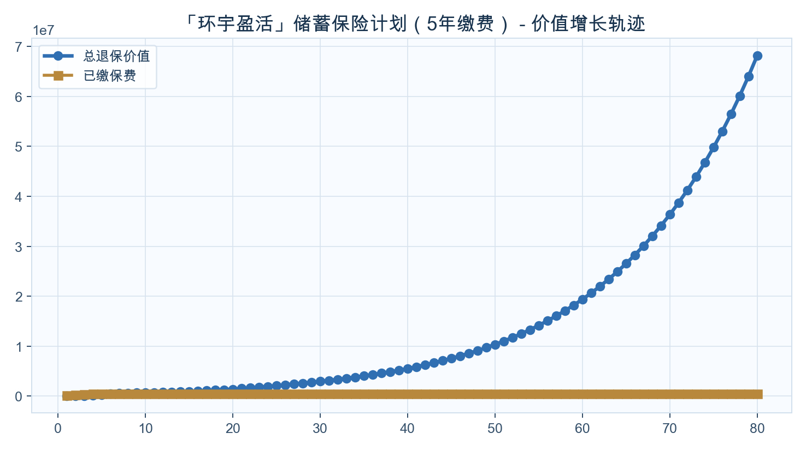
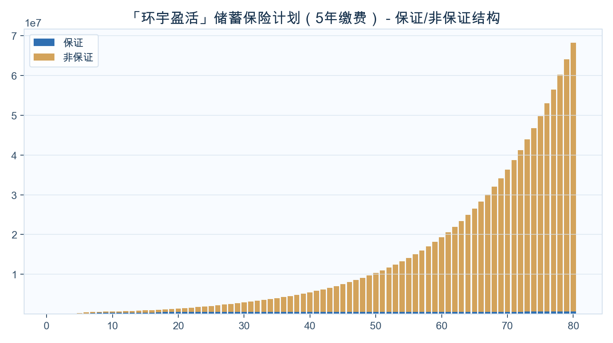

<!-- _class: cover -->
# Boxie
## 家庭资产配置定制方案
### 「环宇盈活」储蓄保险计划（5年缴费）

---

## 公司介绍与资质

  

  
<ul><li>友邦保险</li><li>友邦保险提供长期储蓄、保障与财富传承方案。公司介绍页仅使用已入库资料和可追溯公开来源。</li><li>内部资料索引：友邦-一图简介.pdf</li></ul>

---

## 养老金方案（按年龄自动分流）

  

  
<ul><li>目标：60岁后养老金</li><li>输出：起提年份、累计提领、剩余现金价值</li></ul>
开始提领：保单第6年（约7岁）；18岁累计提领：US$420,000；21岁累计提领：US$525,000

---

## 价值增长曲线（默认展示到保单80年）

  

  
<ul><li>不提领20/30年相对本金倍数</li><li>长期增长趋势</li></ul>
不提领20年：约本金2.72倍；不提领30年：约本金5.85倍。

---

## 保证/非保证构成（默认展示到保单80年）

  

  
<ul><li>保证底盘与弹性贡献</li></ul>
先看保证底盘，再看非保证弹性，明确长期收益主要来源。

---

## 里程碑一：前中期资金规划

<h3>10岁</h3>
保单第9年

年提领 US$35,000

累计提领 US$140,000

剩余价值 US$474,053

<h3>20岁</h3>
保单第19年

年提领 US$35,000

累计提领 US$490,000

剩余价值 US$479,201

<h3>30岁</h3>
保单第29年

年提领 US$35,000

累计提领 US$840,000

剩余价值 US$534,427

<h3>45岁</h3>
保单第44年

年提领 US$35,000

累计提领 US$1,365,000

剩余价值 US$543,666

---

## 里程碑二：中后期与养老规划

<h3>45岁</h3>
保单第44年

年提领 US$35,000

累计提领 US$1,365,000

剩余价值 US$543,666

<h3>60岁</h3>
保单第59年

年提领 US$35,000

累计提领 US$1,890,000

剩余价值 US$566,240

<h3>65岁</h3>
保单第64年

年提领 US$35,000

累计提领 US$2,065,000

剩余价值 US$577,755

<h3>80岁</h3>
保单第79年

年提领 US$35,000

累计提领 US$2,590,000

剩余价值 US$643,285

---

## 提领方案数据表（每10年）

<table class="data-table"><thead><tr><th>年龄</th><th>保单年度</th><th>已交总保费</th><th>领取金额</th><th>累计领取</th><th>退保现金价值</th><th>单利</th><th>复利</th></tr></thead><tbody><tr><td>2</td><td>1</td><td>100,000</td><td>0</td><td>0</td><td>103</td><td>-99.90%</td><td>-99.90%</td></tr><tr><td>11</td><td>10</td><td>403,372</td><td>35,000</td><td>175,000</td><td>467,019</td><td>1.58%</td><td>1.48%</td></tr><tr><td>21</td><td>20</td><td>198,678</td><td>35,000</td><td>525,000</td><td>479,749</td><td>7.07%</td><td>4.51%</td></tr><tr><td>31</td><td>30</td><td>104,478</td><td>35,000</td><td>875,000</td><td>544,522</td><td>14.04%</td><td>5.66%</td></tr><tr><td>41</td><td>40</td><td>56,537</td><td>35,000</td><td>1,225,000</td><td>539,972</td><td>21.38%</td><td>5.80%</td></tr><tr><td>51</td><td>50</td><td>32,024</td><td>35,000</td><td>1,575,000</td><td>552,309</td><td>32.49%</td><td>5.86%</td></tr><tr><td>61</td><td>60</td><td>18,305</td><td>35,000</td><td>1,925,000</td><td>568,270</td><td>50.07%</td><td>5.89%</td></tr><tr><td>71</td><td>70</td><td>10,801</td><td>35,000</td><td>2,275,000</td><td>597,062</td><td>77.54%</td><td>5.90%</td></tr><tr><td>81</td><td>80</td><td>6,544</td><td>35,000</td><td>2,625,000</td><td>650,209</td><td>122.95%</td><td>5.92%</td></tr><tr><td>91</td><td>90</td><td>4,199</td><td>35,000</td><td>2,975,000</td><td>749,382</td><td>197.19%</td><td>5.93%</td></tr></tbody></table>

缴费方式：10万美金 × 5年约第20年达到2倍约第30年达到3倍单利/复利用于观察阶段性效率

---

## 不提领方案数据表（每10年）

<table class="data-table"><thead><tr><th>年龄</th><th>保单年度</th><th>已交总保费</th><th>领取金额</th><th>累计领取</th><th>退保现金价值</th><th>单利</th><th>复利</th></tr></thead><tbody><tr><td>2</td><td>1</td><td>100,000</td><td>0</td><td>0</td><td>103</td><td>-99.90%</td><td>-99.90%</td></tr><tr><td>11</td><td>10</td><td>500,000</td><td>0</td><td>0</td><td>659,765</td><td>3.20%</td><td>2.81%</td></tr><tr><td>21</td><td>20</td><td>500,000</td><td>0</td><td>0</td><td>1,357,738</td><td>8.58%</td><td>5.12%</td></tr><tr><td>31</td><td>30</td><td>500,000</td><td>0</td><td>0</td><td>2,927,387</td><td>16.18%</td><td>6.07%</td></tr><tr><td>41</td><td>40</td><td>500,000</td><td>0</td><td>0</td><td>5,495,108</td><td>24.98%</td><td>6.18%</td></tr><tr><td>51</td><td>50</td><td>500,000</td><td>0</td><td>0</td><td>10,315,074</td><td>39.26%</td><td>6.24%</td></tr><tr><td>61</td><td>60</td><td>500,000</td><td>0</td><td>0</td><td>19,362,813</td><td>62.88%</td><td>6.28%</td></tr><tr><td>71</td><td>70</td><td>500,000</td><td>0</td><td>0</td><td>36,346,662</td><td>102.42%</td><td>6.31%</td></tr><tr><td>81</td><td>80</td><td>500,000</td><td>0</td><td>0</td><td>68,227,682</td><td>169.32%</td><td>6.34%</td></tr><tr><td>91</td><td>90</td><td>500,000</td><td>0</td><td>0</td><td>128,072,738</td><td>283.49%</td><td>6.36%</td></tr></tbody></table>

缴费方式：10万美金 × 5年约第20年达到2倍约第30年达到3倍单利/复利用于观察阶段性效率

---

## 结束语与祝愿

  

  
<ul><li>祝愿家庭资产稳健增长、代际传承顺利</li><li>本方案用于沟通理解，最终权益以保险公司正式文件为准</li></ul>

