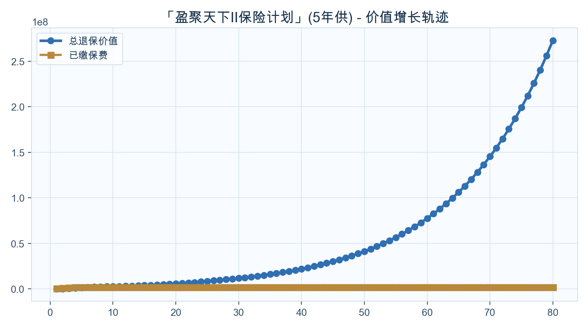
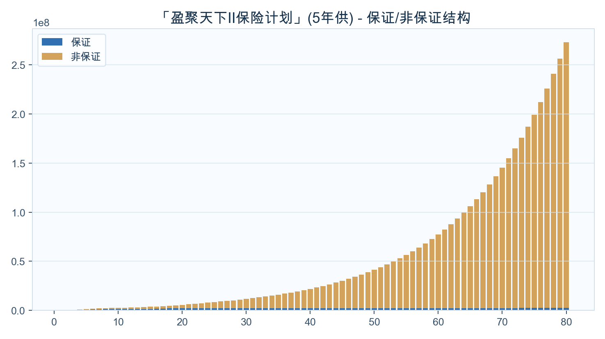

<!-- _class: cover -->
# Boxie
## 家庭资产配置定制方案
### 盈聚天下II保险计划

---

## 公司介绍与资质

  

  
<ul><li>富卫</li><li>公司资料来自内部知识库，正式展示前需通过来源校验。</li><li>内部资料索引：尊衛您（寰譽版）醫療計劃支援及服務簡介.pdf</li></ul>

---

## 养老金方案（按年龄自动分流）

  

  
<ul><li>目标：60岁后养老金</li><li>输出：起提年份、累计提领、剩余现金价值</li></ul>
开始提领：保单第11年（约69岁）；18岁累计提领：US$0；21岁累计提领：US$0

---

## 价值增长曲线（默认展示到保单80年）

  

  
<ul><li>不提领20/30年相对本金倍数</li><li>长期增长趋势</li></ul>
不提领20年：约本金2.86倍；不提领30年：约本金5.85倍。

---

## 保证/非保证构成（默认展示到保单80年）

  

  
<ul><li>保证底盘与弹性贡献</li></ul>
先看保证底盘，再看非保证弹性，明确长期收益主要来源。

---

## 里程碑一：前中期资金规划

<h3>10岁</h3>
暂无数据

<h3>20岁</h3>
暂无数据

<h3>30岁</h3>
暂无数据

<h3>45岁</h3>
暂无数据

---

## 里程碑二：中后期与养老规划

<h3>45岁</h3>
暂无数据

<h3>60岁</h3>
保单第2年

年提领 US$0

累计提领 US$0

剩余价值 US$9,600

<h3>65岁</h3>
保单第7年

年提领 US$0

累计提领 US$0

剩余价值 US$2,069,861

<h3>80岁</h3>
保单第22年

年提领 US$200,000

累计提领 US$2,400,000

剩余价值 US$3,459,582

---

## 提领方案数据表（每10年）

<table class="data-table"><thead><tr><th>年龄</th><th>保单年度</th><th>已交总保费</th><th>领取金额</th><th>累计领取</th><th>退保现金价值</th><th>单利</th><th>复利</th></tr></thead><tbody><tr><td>68</td><td>10</td><td>2,000,000</td><td>0</td><td>0</td><td>2,642,833</td><td>3.21%</td><td>2.83%</td></tr><tr><td>78</td><td>20</td><td>1,352,007</td><td>200,000</td><td>2,000,000</td><td>3,239,070</td><td>6.98%</td><td>4.47%</td></tr><tr><td>88</td><td>30</td><td>875,263</td><td>200,000</td><td>4,000,000</td><td>3,944,479</td><td>11.69%</td><td>5.15%</td></tr><tr><td>98</td><td>40</td><td>623,651</td><td>200,000</td><td>6,000,000</td><td>4,705,445</td><td>16.36%</td><td>5.18%</td></tr><tr><td>108</td><td>50</td><td>490,759</td><td>200,000</td><td>8,000,000</td><td>6,133,883</td><td>23.00%</td><td>5.18%</td></tr><tr><td>118</td><td>60</td><td>420,974</td><td>200,000</td><td>10,000,000</td><td>8,815,257</td><td>33.23%</td><td>5.20%</td></tr><tr><td>128</td><td>70</td><td>384,280</td><td>200,000</td><td>12,000,000</td><td>13,848,565</td><td>50.05%</td><td>5.25%</td></tr><tr><td>138</td><td>80</td><td>364,928</td><td>200,000</td><td>14,000,000</td><td>23,296,776</td><td>78.55%</td><td>5.33%</td></tr></tbody></table>

缴费方式：10万美金 × 5年约第20年达到2倍约第30年达到3倍单利/复利用于观察阶段性效率

---

## 不提领方案数据表（每10年）

<table class="data-table"><thead><tr><th>年龄</th><th>保单年度</th><th>已交总保费</th><th>领取金额</th><th>累计领取</th><th>退保现金价值</th><th>单利</th><th>复利</th></tr></thead><tbody><tr><td>59</td><td>1</td><td>400,000</td><td>0</td><td>0</td><td>0</td><td>-100.00%</td><td>-100.00%</td></tr><tr><td>68</td><td>10</td><td>2,000,000</td><td>0</td><td>0</td><td>2,642,833</td><td>3.21%</td><td>2.83%</td></tr><tr><td>78</td><td>20</td><td>2,000,000</td><td>0</td><td>0</td><td>5,727,912</td><td>9.32%</td><td>5.40%</td></tr><tr><td>88</td><td>30</td><td>2,000,000</td><td>0</td><td>0</td><td>11,709,282</td><td>16.18%</td><td>6.07%</td></tr><tr><td>98</td><td>40</td><td>2,000,000</td><td>0</td><td>0</td><td>21,980,207</td><td>24.98%</td><td>6.18%</td></tr><tr><td>108</td><td>50</td><td>2,000,000</td><td>0</td><td>0</td><td>41,260,104</td><td>39.26%</td><td>6.24%</td></tr><tr><td>118</td><td>60</td><td>2,000,000</td><td>0</td><td>0</td><td>77,450,960</td><td>62.88%</td><td>6.28%</td></tr><tr><td>128</td><td>70</td><td>2,000,000</td><td>0</td><td>0</td><td>145,386,465</td><td>102.42%</td><td>6.31%</td></tr><tr><td>138</td><td>80</td><td>2,000,000</td><td>0</td><td>0</td><td>272,910,152</td><td>169.32%</td><td>6.34%</td></tr></tbody></table>

缴费方式：10万美金 × 5年约第20年达到2倍约第30年达到3倍单利/复利用于观察阶段性效率

---

## 结束语与祝愿

  

  
<ul><li>祝愿家庭资产稳健增长、代际传承顺利</li><li>本方案用于沟通理解，最终权益以保险公司正式文件为准</li></ul>

