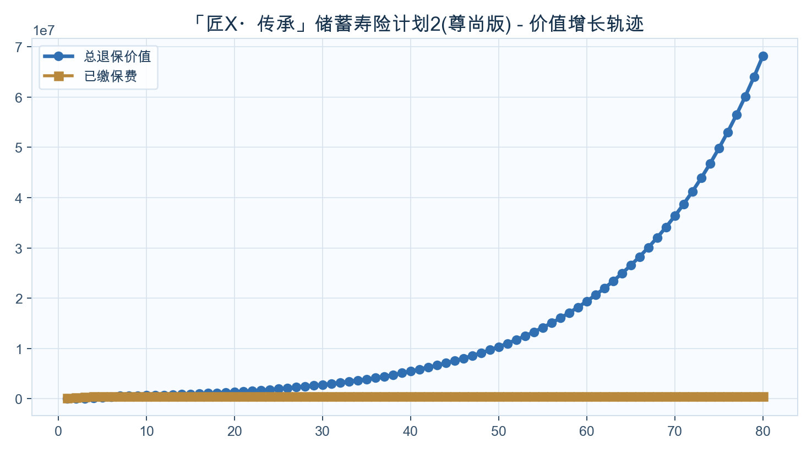
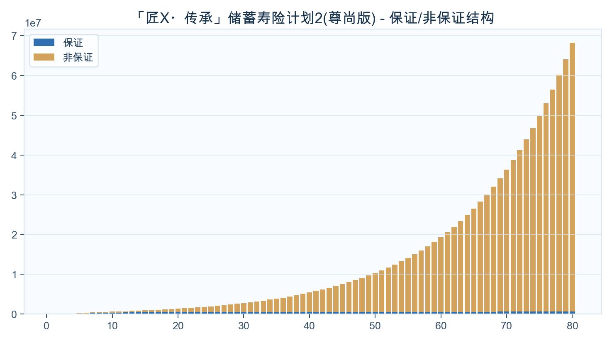
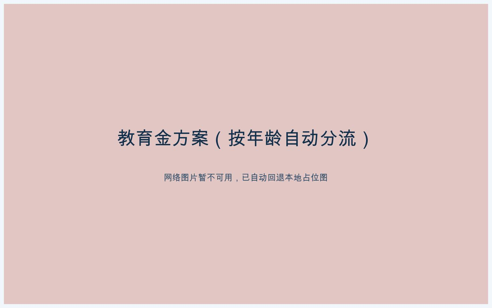

<!-- _class: cover -->
# VIP 先生
## 家庭资产配置定制方案
### 「匠X・传承」储蓄寿险计划2(尊尚版)

---

## 公司介绍与资质

  

  
<ul><li>友邦保险</li><li>友邦保险提供长期储蓄、保障与财富传承方案。公司介绍页仅使用已入库资料和可追溯公开来源。</li><li>内部资料索引：友邦-一图简介.pdf</li></ul>

---

## 教育金方案（按年龄自动分流）

  

  
<ul><li>目标：18-21岁教育金</li><li>输出：起提年份、累计提领、剩余现金价值</li></ul>
开始提领：保单第-年（约-岁）；18岁累计提领：US$0；21岁累计提领：US$0

---

## 价值增长曲线（默认展示到保单80年）

  

  
<ul><li>不提领20/30年相对本金倍数</li><li>长期增长趋势</li></ul>
不提领20年：约本金2.73倍；不提领30年：约本金5.57倍。

---

## 保证/非保证构成（默认展示到保单80年）

  

  
<ul><li>保证底盘与弹性贡献</li></ul>
先看保证底盘，再看非保证弹性，明确长期收益主要来源。

---

## 里程碑一：前中期资金规划

<h3>10岁</h3>
暂无数据

<h3>20岁</h3>
暂无数据

<h3>30岁</h3>
暂无数据

<h3>45岁</h3>
暂无数据

---

## 里程碑二：中后期与养老规划

<h3>45岁</h3>
暂无数据

<h3>60岁</h3>
暂无数据

<h3>65岁</h3>
暂无数据

<h3>80岁</h3>
暂无数据

---

## 不提领方案数据表（每10年）

<table class="data-table"><thead><tr><th>年龄</th><th>保单年度</th><th>已交总保费</th><th>领取金额</th><th>累计领取</th><th>退保现金价值</th><th>单利</th><th>复利</th></tr></thead><tbody><tr><td>2</td><td>1</td><td>100,000</td><td>0</td><td>0</td><td>2,643</td><td>-97.36%</td><td>-97.36%</td></tr><tr><td>11</td><td>10</td><td>500,000</td><td>0</td><td>0</td><td>638,233</td><td>2.76%</td><td>2.47%</td></tr><tr><td>21</td><td>20</td><td>500,000</td><td>0</td><td>0</td><td>1,366,345</td><td>8.66%</td><td>5.15%</td></tr><tr><td>31</td><td>30</td><td>500,000</td><td>0</td><td>0</td><td>2,782,754</td><td>15.22%</td><td>5.89%</td></tr><tr><td>41</td><td>40</td><td>500,000</td><td>0</td><td>0</td><td>5,457,765</td><td>24.79%</td><td>6.16%</td></tr><tr><td>51</td><td>50</td><td>500,000</td><td>0</td><td>0</td><td>10,315,070</td><td>39.26%</td><td>6.24%</td></tr><tr><td>61</td><td>60</td><td>500,000</td><td>0</td><td>0</td><td>19,362,805</td><td>62.88%</td><td>6.28%</td></tr><tr><td>71</td><td>70</td><td>500,000</td><td>0</td><td>0</td><td>36,346,648</td><td>102.42%</td><td>6.31%</td></tr><tr><td>81</td><td>80</td><td>500,000</td><td>0</td><td>0</td><td>68,227,654</td><td>169.32%</td><td>6.34%</td></tr><tr><td>91</td><td>90</td><td>500,000</td><td>0</td><td>0</td><td>128,072,686</td><td>283.49%</td><td>6.36%</td></tr><tr><td>101</td><td>100</td><td>500,000</td><td>0</td><td>0</td><td>240,410,038</td><td>479.82%</td><td>6.37%</td></tr><tr><td>111</td><td>110</td><td>500,000</td><td>0</td><td>0</td><td>451,282,690</td><td>819.60%</td><td>6.38%</td></tr><tr><td>121</td><td>120</td><td>500,000</td><td>0</td><td>0</td><td>847,119,646</td><td>1411.03%</td><td>6.39%</td></tr><tr><td>122</td><td>121</td><td>500,000</td><td>0</td><td>0</td><td>902,182,423</td><td>1490.38%</td><td>6.39%</td></tr><tr><td>123</td><td>122</td><td>500,000</td><td>0</td><td>0</td><td>960,824,280</td><td>1574.30%</td><td>6.39%</td></tr></tbody></table>

缴费方式：10万美金 × 5年约第20年达到2倍约第30年达到3倍单利/复利用于观察阶段性效率

---

## 结束语与祝愿

  

  
<ul><li>祝愿家庭资产稳健增长、代际传承顺利</li><li>本方案用于沟通理解，最终权益以保险公司正式文件为准</li></ul>

