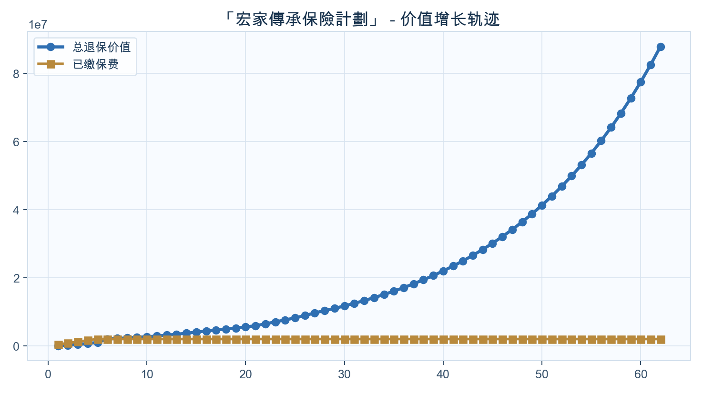
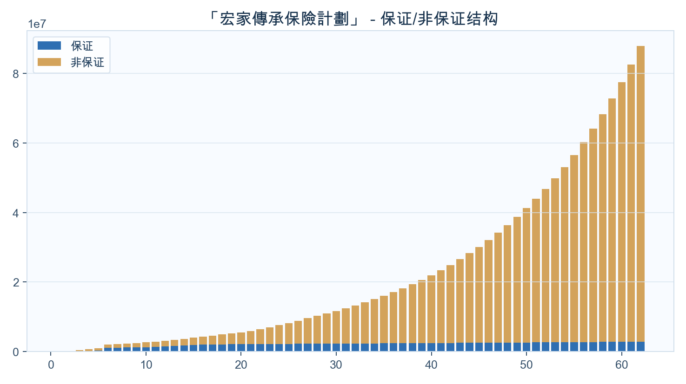

<!-- _class: cover -->
# Boxie
## 家庭资产配置定制方案
### 「宏家傳承保險計劃」

---

## 公司介绍与资质

  

  
<ul><li>宏利</li><li>公司资料来自内部知识库，正式展示前需通过来源校验。</li><li>内部资料索引：Manulife 宏利业务简介202408.pdf</li></ul>

---

## 养老金方案（按年龄自动分流）

  

  
<ul><li>目标：60岁后养老金</li><li>输出：起提年份、累计提领、剩余现金价值</li></ul>
开始提领：保单第11年（约69岁）；18岁累计提领：US$0；21岁累计提领：US$0

---

## 价值增长曲线（默认展示到保单80年）

  

  
<ul><li>不提领20/30年相对本金倍数</li><li>长期增长趋势</li></ul>
不提领20年：约本金2.77倍；不提领30年：约本金5.85倍。

---

## 保证/非保证构成（默认展示到保单80年）

  

  
<ul><li>保证底盘与弹性贡献</li></ul>
先看保证底盘，再看非保证弹性，明确长期收益主要来源。

---

## 里程碑一：前中期资金规划

<h3>10岁</h3>
暂无数据

<h3>20岁</h3>
暂无数据

<h3>30岁</h3>
暂无数据

<h3>45岁</h3>
暂无数据

---

## 里程碑二：中后期与养老规划

<h3>45岁</h3>
暂无数据

<h3>60岁</h3>
保单第2年

年提领 US$0

累计提领 US$0

剩余价值 US$160,000

<h3>65岁</h3>
保单第7年

年提领 US$0

累计提领 US$0

剩余价值 US$2,176,500

<h3>80岁</h3>
保单第22年

年提领 US$67,995

累计提领 US$1,034,970

剩余价值 US$2,808,819

---

## 提领方案数据表（每10年）

<table class="data-table"><thead><tr><th>年龄</th><th>保单年度</th><th>已交总保费</th><th>领取金额</th><th>累计领取</th><th>退保现金价值</th><th>单利</th><th>复利</th></tr></thead><tbody><tr><td>68</td><td>10</td><td>2,000,000</td><td>0</td><td>0</td><td>2,657,398</td><td>3.29%</td><td>2.88%</td></tr><tr><td>78</td><td>20</td><td>2,000,000</td><td>77,929</td><td>893,336</td><td>2,777,507</td><td>1.94%</td><td>1.66%</td></tr><tr><td>88</td><td>30</td><td>2,000,000</td><td>39,498</td><td>1,433,518</td><td>3,033,747</td><td>1.72%</td><td>1.40%</td></tr><tr><td>98</td><td>40</td><td>2,000,000</td><td>22,499</td><td>1,727,151</td><td>2,996,015</td><td>1.25%</td><td>1.02%</td></tr><tr><td>108</td><td>50</td><td>2,000,000</td><td>12,517</td><td>1,893,357</td><td>3,005,187</td><td>1.01%</td><td>0.82%</td></tr><tr><td>118</td><td>60</td><td>2,000,000</td><td>6,583</td><td>1,983,092</td><td>3,301,423</td><td>1.08%</td><td>0.84%</td></tr></tbody></table>

缴费方式：10万美金 × 5年约第-年达到2倍约第-年达到3倍单利/复利用于观察阶段性效率

---

## 不提领方案数据表（每10年）

<table class="data-table"><thead><tr><th>年龄</th><th>保单年度</th><th>已交总保费</th><th>领取金额</th><th>累计领取</th><th>退保现金价值</th><th>单利</th><th>复利</th></tr></thead><tbody><tr><td>59</td><td>1</td><td>400,000</td><td>0</td><td>0</td><td>0</td><td>-100.00%</td><td>-100.00%</td></tr><tr><td>68</td><td>10</td><td>2,000,000</td><td>0</td><td>0</td><td>2,657,398</td><td>3.29%</td><td>2.88%</td></tr><tr><td>78</td><td>20</td><td>2,000,000</td><td>0</td><td>0</td><td>5,545,082</td><td>8.86%</td><td>5.23%</td></tr><tr><td>88</td><td>30</td><td>2,000,000</td><td>0</td><td>0</td><td>11,709,541</td><td>16.18%</td><td>6.07%</td></tr><tr><td>98</td><td>40</td><td>2,000,000</td><td>0</td><td>0</td><td>21,980,418</td><td>24.98%</td><td>6.18%</td></tr><tr><td>108</td><td>50</td><td>2,000,000</td><td>0</td><td>0</td><td>41,260,266</td><td>39.26%</td><td>6.24%</td></tr><tr><td>118</td><td>60</td><td>2,000,000</td><td>0</td><td>0</td><td>77,451,191</td><td>62.88%</td><td>6.28%</td></tr></tbody></table>

缴费方式：10万美金 × 5年约第20年达到2倍约第30年达到3倍单利/复利用于观察阶段性效率

---

## 结束语与祝愿

  

  
<ul><li>祝愿家庭资产稳健增长、代际传承顺利</li><li>本方案用于沟通理解，最终权益以保险公司正式文件为准</li></ul>

