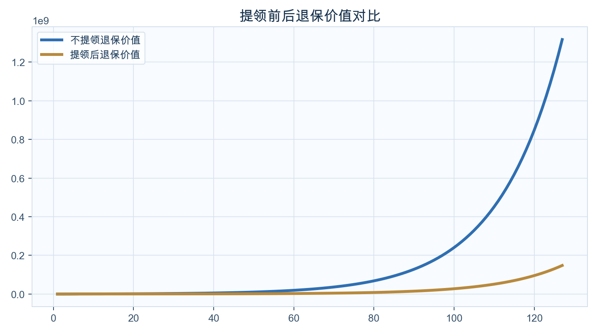
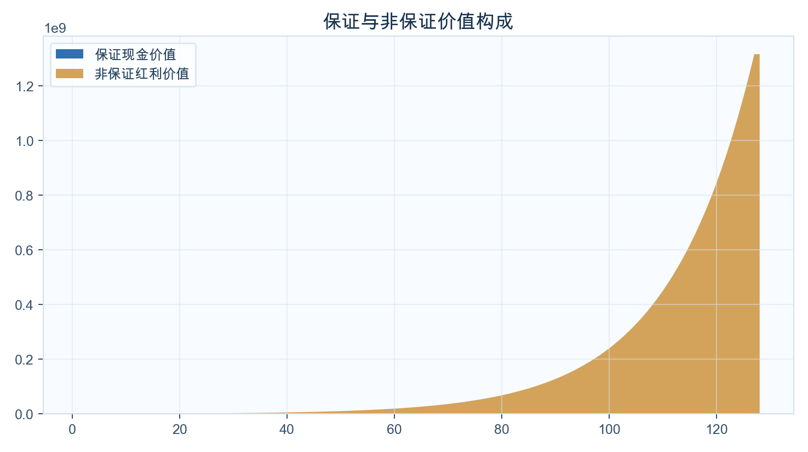
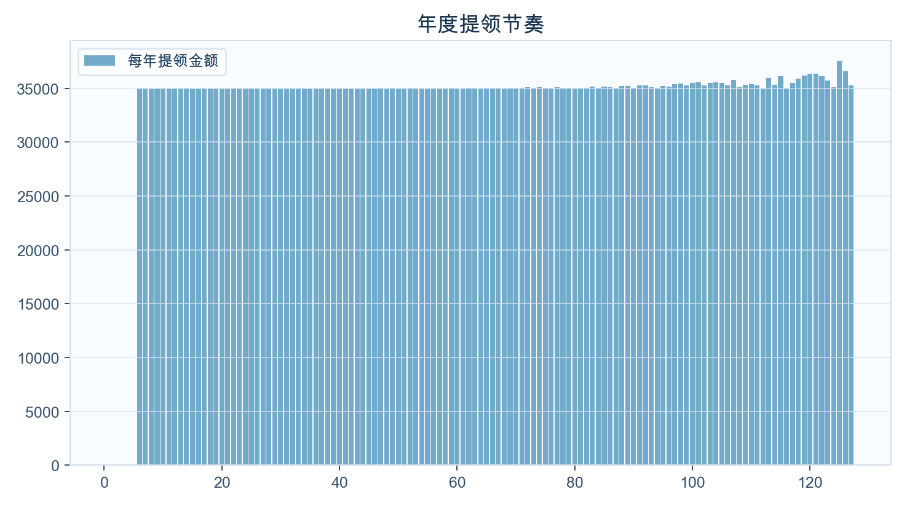
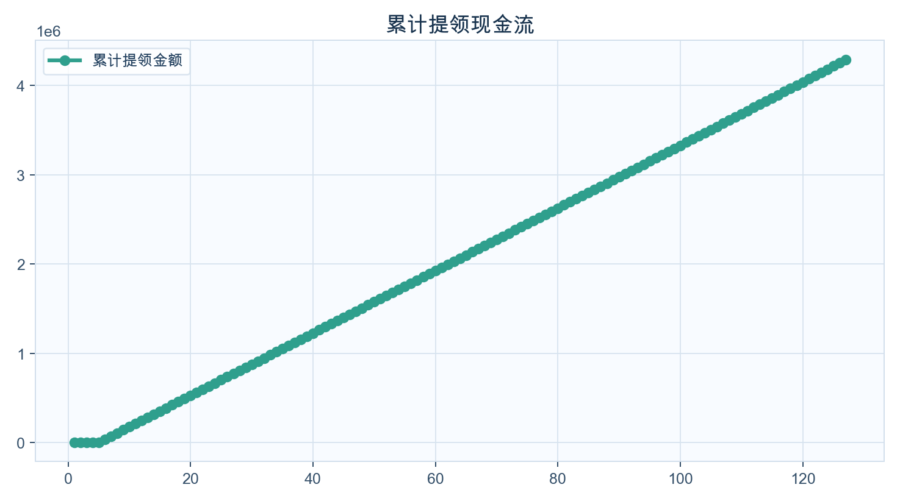

<!-- _class: cover -->
# VIP 先生 储蓄险定制计划书
## 「匠X・传承」储蓄寿险计划2（尊尚版）

以 1 岁被保人为核心，围绕教育金与养老金双目标

---
## 公司介绍与资质

  

  

    <h3>周大福人寿（CTF Life）</h3>
    <ul>
      <li>Fitch 财务实力评级：A-</li>
      <li>Moody's 财务实力评级：A3</li>
      <li>香港RBC偿付能力充足率：282%（截至2025-12-31）</li>
      <li>定位：长期保障 + 家庭财富传承</li>
    </ul>
    
这页的作用是先建立客户对保险公司的信任，再进入产品方案细节。

  

---
## 保单参数总览

被保人<b>VIP 先生（1岁）</b>

缴费期<b>5年</b>

年缴保费<b>US$ 100,000</b>

总缴保费<b>US$ 500,000</b>

第7年退保价值约 US$ 514,498；第16年约 US$ 980,864；第20年约 US$ 1,366,345。

---
## 教育金场景（18-21岁）

  

  

    <h3>1 岁投保 -> 18 岁进入教育金窗口</h3>
    <ul>
      <li>18岁累计可提领：US$ 420,004</li>
      <li>21岁累计可提领：US$ 525,006</li>
      <li>适配用途：学费、住宿、海外交换与研究经费</li>
    </ul>
    
这部分强调“资金什么时候可用、能支持哪些教育节点”，避免只讲收益不讲场景。

  

---
## 图表解读：提领前后退保价值

  

  

    <h3>看什么？</h3>
    <ul>
      <li>蓝线：不提领时的退保价值</li>
      <li>金线：持续提领后的退保价值</li>
      <li>两条线都向上，说明提领后仍保留长期价值</li>
    </ul>
    
这张图用于回答客户最关心的问题：提款之后，保单会不会“被掏空”。

  

---
## 图表解读：保证与非保证构成

  

  

    <h3>看什么？</h3>
    <ul>
      <li>深蓝：保证现金价值</li>
      <li>金色：非保证红利价值</li>
      <li>时间越长，非保证部分对总价值贡献越明显</li>
    </ul>
    
这页帮助客户理解“稳健底盘 + 红利弹性”的结构，不把产品讲成单一收益模型。

  

---
## 提领里程碑时间轴（代表年度）

  

  
6岁

  
每年提领 US$ 0

  
累计提领 US$ 0

  
剩余退保值 US$ 234,795

  
10岁

  
每年提领 US$ 35,000

  
累计提领 US$ 140,001

  
剩余退保值 US$ 424,733

  
20岁

  
每年提领 US$ 35,001

  
累计提领 US$ 490,006

  
剩余退保值 US$ 531,764

  
30岁

  
每年提领 US$ 35,003

  
累计提领 US$ 840,015

  
剩余退保值 US$ 699,318

  
45岁

  
每年提领 US$ 35,003

  
累计提领 US$ 1,365,051

  
剩余退保值 US$ 1,154,504

  
60岁

  
每年提领 US$ 35,020

  
累计提领 US$ 1,890,177

  
剩余退保值 US$ 2,463,361

从第6年开始可形成稳定提领，20岁阶段重点覆盖教育金，30-45岁覆盖家庭现金流，60岁后可转养老金用途。

---
## 提领方案数据表（每10年展示）

  
<table class="data-table">
    <thead><tr><th>年龄</th><th>保单年度</th><th>已交总保费</th><th>领取金额</th><th>累计领取</th><th>退保现金价值</th><th>单利</th><th>复利</th></tr></thead>
    <tbody><tr>
    <td>2</td>
    <td>1</td>
    <td>100,000</td>
    <td>0</td>
    <td>0</td>
    <td>2,643</td>
    <td>-97.36%</td>
    <td>-97.36%</td>
  </tr><tr>
    <td>11</td>
    <td>10</td>
    <td>500,000</td>
    <td>35,000</td>
    <td>175,001</td>
    <td>449,186</td>
    <td>-1.02%</td>
    <td>-1.07%</td>
  </tr><tr>
    <td>21</td>
    <td>20</td>
    <td>500,000</td>
    <td>35,000</td>
    <td>525,006</td>
    <td>553,772</td>
    <td>0.54%</td>
    <td>0.51%</td>
  </tr><tr>
    <td>31</td>
    <td>30</td>
    <td>500,000</td>
    <td>35,003</td>
    <td>875,018</td>
    <td>716,823</td>
    <td>1.45%</td>
    <td>1.21%</td>
  </tr><tr>
    <td>41</td>
    <td>40</td>
    <td>500,000</td>
    <td>35,005</td>
    <td>1,225,045</td>
    <td>985,224</td>
    <td>2.43%</td>
    <td>1.71%</td>
  </tr><tr>
    <td>51</td>
    <td>50</td>
    <td>500,000</td>
    <td>35,007</td>
    <td>1,575,098</td>
    <td>1,526,323</td>
    <td>4.11%</td>
    <td>2.26%</td>
  </tr><tr>
    <td>61</td>
    <td>60</td>
    <td>500,000</td>
    <td>35,008</td>
    <td>1,925,185</td>
    <td>2,610,075</td>
    <td>7.03%</td>
    <td>2.79%</td>
  </tr><tr>
    <td>71</td>
    <td>70</td>
    <td>500,000</td>
    <td>35,013</td>
    <td>2,275,414</td>
    <td>4,607,809</td>
    <td>11.74%</td>
    <td>3.22%</td>
  </tr><tr>
    <td>81</td>
    <td>80</td>
    <td>500,000</td>
    <td>35,008</td>
    <td>2,625,899</td>
    <td>8,176,510</td>
    <td>19.19%</td>
    <td>3.55%</td>
  </tr><tr>
    <td>91</td>
    <td>90</td>
    <td>500,000</td>
    <td>35,061</td>
    <td>2,976,915</td>
    <td>14,874,836</td>
    <td>31.94%</td>
    <td>3.84%</td>
  </tr><tr>
    <td>101</td>
    <td>100</td>
    <td>500,000</td>
    <td>35,497</td>
    <td>3,329,531</td>
    <td>27,446,484</td>
    <td>53.89%</td>
    <td>4.09%</td>
  </tr><tr>
    <td>111</td>
    <td>110</td>
    <td>500,000</td>
    <td>35,389</td>
    <td>3,683,718</td>
    <td>51,042,767</td>
    <td>91.90%</td>
    <td>4.29%</td>
  </tr><tr>
    <td>121</td>
    <td>120</td>
    <td>500,000</td>
    <td>36,341</td>
    <td>4,040,361</td>
    <td>95,333,722</td>
    <td>158.06%</td>
    <td>4.47%</td>
  </tr><tr>
    <td>122</td>
    <td>121</td>
    <td>500,000</td>
    <td>36,328</td>
    <td>4,076,689</td>
    <td>101,494,085</td>
    <td>166.93%</td>
    <td>4.49%</td>
  </tr><tr>
    <td>123</td>
    <td>122</td>
    <td>500,000</td>
    <td>36,133</td>
    <td>4,112,822</td>
    <td>108,055,068</td>
    <td>176.32%</td>
    <td>4.50%</td>
  </tr></tbody>
  </table>

  

    <h3>提领方案解读</h3>
    <ul>
      <li>缴费方式：10万美金 × 5年</li>
      <li>以「退保价值+累计提领」口径：约第13年达到2倍</li>
      <li>以同口径：约第17年达到3倍</li>
      <li>表内单利/复利用于观察各阶段年化效率变化</li>
    </ul>
  

说明：该表为“提领后口径”，展示流动性与剩余资产并存的路径。

---
## 不提领方案数据表（每10年展示）

  
<table class="data-table">
    <thead><tr><th>年龄</th><th>保单年度</th><th>已交总保费</th><th>领取金额</th><th>累计领取</th><th>退保现金价值</th><th>单利</th><th>复利</th></tr></thead>
    <tbody><tr>
    <td>2</td>
    <td>1</td>
    <td>100,000</td>
    <td>0</td>
    <td>0</td>
    <td>2,643</td>
    <td>-97.36%</td>
    <td>-97.36%</td>
  </tr><tr>
    <td>11</td>
    <td>10</td>
    <td>500,000</td>
    <td>0</td>
    <td>0</td>
    <td>638,233</td>
    <td>2.76%</td>
    <td>2.47%</td>
  </tr><tr>
    <td>21</td>
    <td>20</td>
    <td>500,000</td>
    <td>0</td>
    <td>0</td>
    <td>1,366,345</td>
    <td>8.66%</td>
    <td>5.15%</td>
  </tr><tr>
    <td>31</td>
    <td>30</td>
    <td>500,000</td>
    <td>0</td>
    <td>0</td>
    <td>2,782,754</td>
    <td>15.22%</td>
    <td>5.89%</td>
  </tr><tr>
    <td>41</td>
    <td>40</td>
    <td>500,000</td>
    <td>0</td>
    <td>0</td>
    <td>5,457,765</td>
    <td>24.79%</td>
    <td>6.16%</td>
  </tr><tr>
    <td>51</td>
    <td>50</td>
    <td>500,000</td>
    <td>0</td>
    <td>0</td>
    <td>10,315,070</td>
    <td>39.26%</td>
    <td>6.24%</td>
  </tr><tr>
    <td>61</td>
    <td>60</td>
    <td>500,000</td>
    <td>0</td>
    <td>0</td>
    <td>19,362,805</td>
    <td>62.88%</td>
    <td>6.28%</td>
  </tr><tr>
    <td>71</td>
    <td>70</td>
    <td>500,000</td>
    <td>0</td>
    <td>0</td>
    <td>36,346,648</td>
    <td>102.42%</td>
    <td>6.31%</td>
  </tr><tr>
    <td>81</td>
    <td>80</td>
    <td>500,000</td>
    <td>0</td>
    <td>0</td>
    <td>68,227,654</td>
    <td>169.32%</td>
    <td>6.34%</td>
  </tr><tr>
    <td>91</td>
    <td>90</td>
    <td>500,000</td>
    <td>0</td>
    <td>0</td>
    <td>128,072,686</td>
    <td>283.49%</td>
    <td>6.36%</td>
  </tr><tr>
    <td>101</td>
    <td>100</td>
    <td>500,000</td>
    <td>0</td>
    <td>0</td>
    <td>240,410,038</td>
    <td>479.82%</td>
    <td>6.37%</td>
  </tr><tr>
    <td>111</td>
    <td>110</td>
    <td>500,000</td>
    <td>0</td>
    <td>0</td>
    <td>451,282,690</td>
    <td>819.60%</td>
    <td>6.38%</td>
  </tr><tr>
    <td>121</td>
    <td>120</td>
    <td>500,000</td>
    <td>0</td>
    <td>0</td>
    <td>847,119,646</td>
    <td>1411.03%</td>
    <td>6.39%</td>
  </tr><tr>
    <td>122</td>
    <td>121</td>
    <td>500,000</td>
    <td>0</td>
    <td>0</td>
    <td>902,182,423</td>
    <td>1490.38%</td>
    <td>6.39%</td>
  </tr><tr>
    <td>123</td>
    <td>122</td>
    <td>500,000</td>
    <td>0</td>
    <td>0</td>
    <td>960,824,280</td>
    <td>1574.30%</td>
    <td>6.39%</td>
  </tr></tbody>
  </table>

  

    <h3>不提领方案解读</h3>
    <ul>
      <li>缴费方式：10万美金 × 5年</li>
      <li>仅看退保价值：约第17年达到2倍</li>
      <li>仅看退保价值：约第22年达到3倍</li>
      <li>该路径更偏长期增值，不提供中途现金流</li>
    </ul>
  

说明：该表为“不提领口径”，适合与提领方案并排解释“收益 vs 流动性”差异。

---
## 图表解读：年度提领节奏（优化版）

  

  

    <h3>看什么？</h3>
    <ul>
      <li>柱形代表每年提领金额，整体节奏平稳</li>
      <li>适合做家庭预算中的“长期现金流模块”</li>
      <li>可与教育金或退休支出按年匹配</li>
    </ul>
    
这页作用是把保单从“收益产品”转换成“现金流工具”来沟通。

  

---
## 图表解读：累计提领现金流（优化版）

  

  

    <h3>看什么？</h3>
    <ul>
      <li>累计提领随时间持续增长</li>
      <li>45岁累计提领：US$ 1,365,051</li>
      <li>60岁累计提领：US$ 1,890,177</li>
    </ul>
    
用累计线展示“拿走了多少钱”，让客户清晰感知长期兑现能力。

  

---
## 养老金场景（60岁后）

  

  

    <h3>退休收入补充</h3>
    <ul>
      <li>60岁累计提领：US$ 1,890,177</li>
      <li>65岁累计提领：US$ 2,065,252</li>
      <li>65岁提领后退保价值：US$ 3,315,208</li>
      <li>65岁总量（退保值+累计提领）：US$ 5,380,460</li>
    </ul>
    
这一页直连养老目标：不是抽象回报率，而是可领取金额与剩余资产。

  

---
## 家庭资产配置落地建议

  

  

    <h3>执行框架</h3>
    <ul>
      <li>阶段1（1-18岁）：以教育金为目标，重视资金准备时间</li>
      <li>阶段2（32-45岁）：提领用于家庭现金流补充</li>
      <li>阶段3（60岁后）：作为养老金现金流模块</li>
      <li>每3年复盘：提领额度、保单现价、家庭负债变化</li>
    </ul>
    
用“目标-现金流-复盘”闭环，避免方案只停留在纸面。

  

